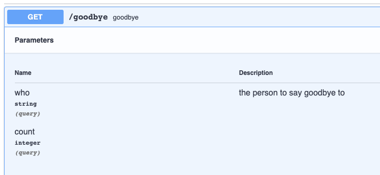
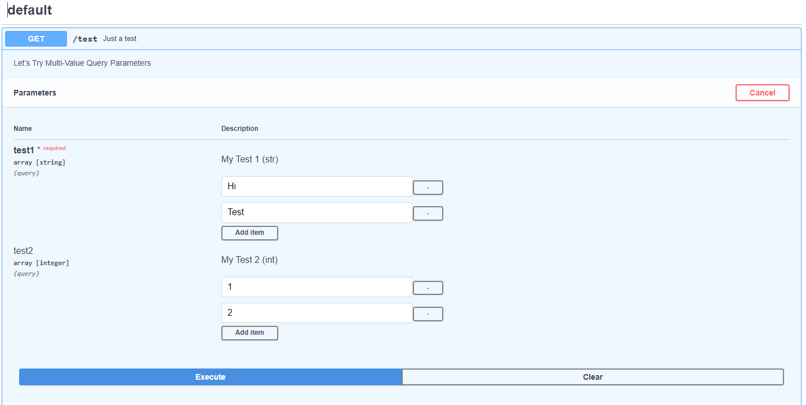

# Serverless Auto Swagger

This plugin allows you to automatically generate a swagger endpoint, describing your application endpoints. This is built from your existing serverless config and typescript definitions, reducing the duplication of work.

## Install

```sh
yarn add --dev serverless-auto-swagger
# or
npm install -D serverless-auto-swagger
```

Add the following plugin to your `serverless.yml` or `serverless.ts`:

```yaml
plugins:
  - serverless-auto-swagger
```

```ts
plugins: ['serverless-auto-swagger'];
```

**_NOTE_**: This plugin should come before any transform plugins (i.e. `serverless-webpack` or `serverless-plugin-typescript`), and _must_ come before `serverless-offline` if included.

## Usage

This plugin is designed to work with vanilla Serverless Framework. All you need to do is add this plugin to your plugin list, and it will generate the swagger file and add the endpoints required. When you deploy your API, your new swagger UI will be available at `https://{your-url-domain}/swagger`.

You can also run `sls generate-swagger` if you want to generate the swagger file without deploying the application.

## Config Options

All config options are optional. Defaults are shown in the table below.

```yaml
custom:
    autoswagger:
        title: 'string'
        apiType: 'http' | 'httpApi'
        generateSwaggerOnDeploy: true | false
        typefiles: ['./src/types/typefile1.d.ts', './src/subfolder/helper.d.ts']
        swaggerFiles: ['./doc/endpointFromPlugin.json', './doc/iCannotPutThisInHttpEvent.json', './doc/aDefinitionWithoutTypescript.json']
        swaggerPath: 'string'
        apiKeyHeaders: ['Authorization', 'anyOtherName']
        useStage: true | false
        basePath: '/string'
        host: 'http://some-host'
        schemes: ['http', 'https', 'ws', 'wss']
        excludeStages: ['production', 'anyOtherStage']
        lambdaAuthorizer: ${self:custom.myAuthorizer}
        useRedirectUI: true | false
```

| Option                    | Description                                                                                                           | Default                                                                    | Example                                                  |
| ------------------------- | --------------------------------------------------------------------------------------------------------------------- | -------------------------------------------------------------------------- | -------------------------------------------------------- |
| `apiKeyHeaders`           | Array of strings used to define API keys used in auth headers                                                         | `[]`                                                                       | `apiKeyHeaders: ['Authorization', 'x-api-key']`          |
| `apiType`                 | API type for which your Swagger UI and Swagger JSON lambdas should be deployed. Options are `http` and `httpApi`      | `httpApi`                                                                  |                                                          |
| `basePath`                | String that can be prepended to every request. Should include leading `/`                                             | -                                                                          | `/some-base` => `http://localhost/some-base/my-endpoint` |
| `excludeStages`           | Array of strings that contains stages in which Swagger UI and Swagger JSON lambdas should **not** be deployed in.     | `[]`                                                                       |                                                          |
| `generateSwaggerOnDeploy` | Boolean which indicates whether to generate a new swagger file on deployment                                          | `true`                                                                     |                                                          |
| `host`                    | String that overrides the host. With this you can set your custom domain for your application endpoints               | -                                                                          | `http://some-host` => `{http://some-host}/my-endpoint`   |
| `lambdaAuthorizer`        | A String or authorizer object to add security to the lambda `/swagger` and `/swagger.json` endpoints                  | -                                                                          |                                                          |
| `schemes`                 | Array (containing one of `http`, `https`, `ws`, or `wss`) for specifying schemes                                      | Scheme used to serve the API specification (reflecting Swagger's behavior) |                                                          |
| `swaggerFiles`            | Array of string which will merge custom json OpenApi 2.0 files to the generated swagger                               | `[]`                                                                       |                                                          |
| `swaggerPath`             | String for customize swagger path. Your new swagger UI will be available at `https://{your-url-domain}/{swaggerPath}` | `swagger`                                                                  | `my-swagger` => `https://{your-url-domain}/my-swagger`   |
| `title`                   | String to overwrite the project title with a custom one                                                               | Serverless service name                                                    |                                                          |
| `description`             | String to add the project description                                                                                 | -                                                                          |                                                          |
| `version`                 | String to overwrite the project version with a custom one                                                             | `1`                                                                        |                                                          |
| `typefiles`               | Array of strings which defines where to find the typescript types to use for the request and response bodies          | `['./src/types/api-types.d.ts']`                                           |                                                          |
| `useStage`                | Boolean to either use current stage in beginning of path or not                                                       | `false`                                                                    | `true` => `dev/swagger` for stage `dev`                  |
| `useRedirectUI`           | Boolean to include a path and handler for the oauth2 redirect flow or not                                             | `false`                                                                    |                                                          |

## Adding more details

The default swagger file from vanilla Serverless framework will have the correct paths and methods but no details about the requests or responses.

### API Summary and Details

The optional attributes `summary` and `description` can be used to describe each HTTP request in Swagger.

`swaggerTags` is an optional array that can be used to group HTTP requests with a collapsible name
(i.e. grouping two endpoints `GET /dogs` and `POST /dogs` together).
If not specified, all HTTP requests will be grouped under `default`.

```js
http: {
    summary: 'This is a cool API',
    description: 'Cool API description is here',
    swaggerTags: ['Dogs']
}
```

### Adding Data Types

This plugin uses typescript types to generate the data types for the endpoints. By default, it pulls the types from `src/types/api-types.d.ts`.

You can then assign these typescript definitions to requests as `bodyType` on the http or https config, or to the response as seen just below.

### Responses

You can also add expected responses to each of the http endpoint events. This is an object that contains the response code with some example details:

```js
responseData: {
    // response with description and response body
    200: {
        description: 'this went well',
        bodyType: 'helloPostResponse',
    },

    // response with just a description
    400: {
        description: 'failed Post',
    },
    // shorthand for just a description
    502: 'server error',
}
```

### Post request expected body

When you create a `POST` or `PUT` endpoint, you expect to receive a specific structure of data as the body of the request.

You can do that by adding a `bodyType` to the http event:

```js
http: {
    path: 'hello',
    method: 'post',
    cors: true,
    bodyType: 'helloPostBody',
}
```

### Query String Parameters

If you want to specify the query string parameters on an endpoint you can do this by adding an object of `queryStringParameters` to the event (original I know). This has two required properties of `required` and `type` as well as an optional `description`.

```js
http: {
    path: 'goodbye',
    method: 'get',
    queryStringParameters: {
        bob: {
            required: true,
            type: 'string',
            description: 'bob',
        },
        count: {
            required: false,
            type: 'integer',
        },
    },
},
```



If no `queryStringParameters` are defined, the plugin will do its best to generate headers based on any Serverless `request.parameters.querystrings` that are defined.

### Multi-Valued Query String Parameters

If you use multi-value query string parameters (array), then you must specify that your `type` is `array` and specify your data type (string or integer) in `arrayItemsType`

```js
http: {
    path: 'goodbye',
    method: 'get',
    queryStringParameters: {
        bob: {
            required: true,
            type: 'array',
            arrayItemsType : 'string',
            description: 'bob',
        },
        count: {
            required: false,
            type: 'array',
            arrayItemsType : 'integer',
        },
    },
},
```



### Header Params

Works the same way as `queryStringParameters`, but for headers.

To use it, just define it under `headerParameters`:

```js
http: {
    path: 'goodbye',
    method: 'get',
    headerParameters: {
        bob: {
            required: true,
            type: 'string',
            description: 'bob',
        },
        count: {
            required: false,
            type: 'integer',
        },
    },
},
```

If no `headerParameters` are defined, the plugin will do its best to generate headers based on any Serverless `request.parameters.headers` that are defined.

### Path Parameters

Path parameters are resolved first by looking at `request.parameters.paths`, and then by resolving any additional parameters in the http event path (i.e. `/{id}`).

### Exclude an endpoint

You can exclude some endpoints from the swagger generation by adding `exclude` to the http event:

```js
http: {
    path: 'hello',
    method: 'post',
    exclude: true,
}
```

### Custom operationId

You can override the automatically generated operationId by adding the `operationId` property to the http event. This can be useful when using code generators.

```js
http: {
    path: 'hello',
    method: 'post',
    operationId: 'postHello',
}
```

### MIME Types

You can specify the MIME types by adding `consumes` and `produces` to the http event. Default for both is `['application/json']`

```js
http: {
    path: 'hello',
    method: 'post',
    consumes: ['application/json', 'application/pdf'],
    produces: ['application/json', 'application/pdf'],
}
```

## with Serverless Offline

In the plugin list, you must list `serverless-auto-swagger` before the `serverless-offline` plugin.
If you don't, you won't get the required endpoints added to your local endpoints.

To use serverless v2, you must run serverless-offline in backwards compatibility mode with `serverless offline start`.
